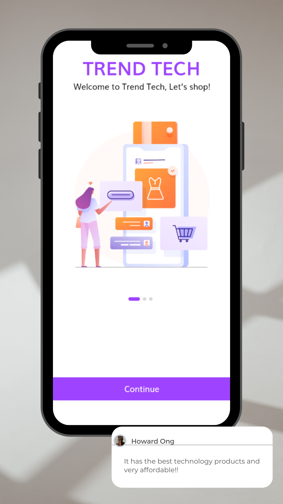

# TREND TECH - ECOMMERCE

## Descripción

TREND TECH - ECOMMERCE es una plataforma de comercio electrónico diseñada para brindar una experiencia de compra moderna y eficiente. Ofrecemos una amplia gama de productos tecnológicos de última generación, manteniéndonos a la vanguardia de las tendencias del mercado.

## Características Principales

- **Catálogo Variado:** Explora nuestra extensa colección de productos tecnológicos y ropa trendy.
  
- **Experiencia de Usuario Intuitiva:** Navega fácilmente a través de nuestra aplicación móvil con una interfaz de usuario amigable y diseñada para la comodidad del cliente.

- **Seguridad Garantizada:** Tu seguridad es nuestra prioridad. Implementamos medidas de seguridad robustas para proteger tus datos personales y transacciones.

- **Proceso de Pago Simple:** Realiza tus compras de manera rápida y segura con nuestro proceso de pago simple y efectivo.

v

## Cómo Empezar

1. **Crea una Cuenta:** Regístrate para obtener una cuenta y disfrutar de beneficios exclusivos.

2. **Añade al Carrito:** Selecciona tus productos favoritos y agrégales al carrito de compras.

3. **Proceso de Pago:** Completa tu compra de manera segura utilizando nuestro proceso de pago intuitivo.

## Contacto

Si tienes preguntas, sugerencias o requieres asistencia, no dudes en contactarnos:

- **Correo Electrónico:** yzam02@gmail.com, 20212243@itla.edu.do y 20212074@itla.edu.do
- **Teléfono:** 234-523-1234

## Licencia

Este proyecto está bajo la licencia [MIT](LICENSE).